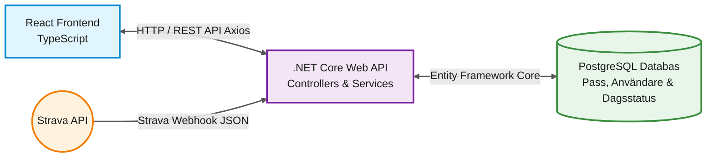

```mermaid
graph LR
  React[React Frontend<br/>TypeScript] <-->|HTTP / REST API Axios| Net[.NET Core Web API<br/>Controllers & Services]
  Net <-->|Entity Framework Core| Postgres[(PostgreSQL Databas<br/>Pass, Användare & Dagsstatus)]
  Strava((Strava API)) -->|Strava Webhook JSON| Net

  %% Styling för hög kontrast och tydlig text %%
  style React fill:#e1f5fe,stroke:#0288d1,stroke-width:2.5px,color:#1a1a1a
  style Net fill:#f3e5f5,stroke:#7b1fa2,stroke-width:2.5px,color:#1a1a1a
  style Postgres fill:#e8f5e9,stroke:#388e3c,stroke-width:2.5px,color:#1a1a1a
  style Strava fill:#fff3e0,stroke:#f57c00,stroke-width:2.5px,color:#1a1a1a

  %% Gör texten på pilarna mörk och tydlig %%
  linkStyle default stroke:#555,stroke-width:2px,color:#1a1a1a
```
